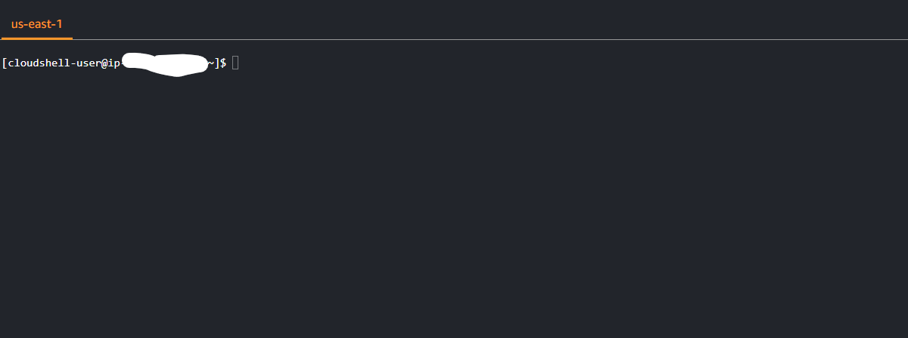

# Week 0 — Billing and Architecture
#AWS CLI INSTALLED USING GITPOD

Successfully Installed AWS CLI using gitpod proof is attached befow, Account Id is hidden but the name is visible for proof.

##Another Image for the proof of AWS CLI

Using AWS help command and Installed autocomplete feature for Gitpod

#CLOUD SHELL

Entering Random cloudshell picture :)

#IAM user creation

Created the AWS account and secured the root user with MFA, Created IAM user with required "Billing" and "Admin" policies and turned MFA on for the newly created IAM user. Created Access keys to access account programatically.
User Authenticator (Virtual) service for MFA.

#SETTING UP BUDGET AND BILLING ALARM 

Created 10$ Budget and alarm for credits using CLI and another budget using GUI, Proof attached below.

#THANKS TO ANDREW FOR THE CREDITS

Applied credits in the account

#LUCID CHART FOR THE ARCHITECTURE OF THE APP

Made this chart after watching the Video on youtube

[Lucid Chart Link](https://lucid.app/lucidchart/d2ea535c-e27e-43c7-869b-4eed08de212d/edit?view_items=ed.xAJ5mzVJN&invitationId=inv_f78cf69b-eeb3-44fa-97ab-a504a9ecc02a)

