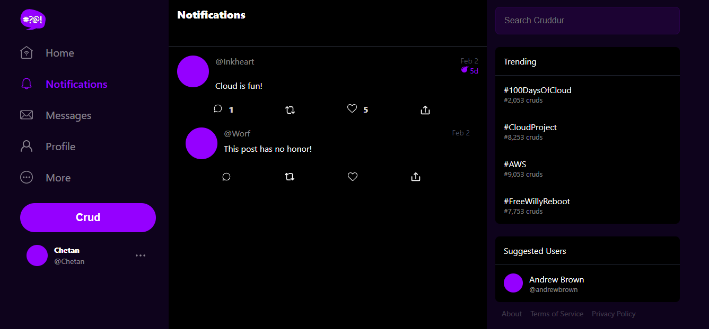

# Week 1 — App Containerization
#SUMMERY OF THE WEEK 1 WORK

##Completed all the assignments for the week according to summary on student portal

1. Explored the codspaces and gitpod, fixed the environment variables (Was having Issue in loading the aws cli) and configured gitpod.yml file.

2. Containerized the application using dockerfile.

3. To run both containers created docker-compose.yml file.

4. In frontend directory did NPM install and open port 3000 for the frontend.

5. Created Notifications page in backend directory and edited the code in app.py to show the content on the frontend.

6. Created a new endpooint API for the notifications page which allows port 4567 to to be public and extract info from the backend.

7. Databases Installed in dockerfile - Postgres and Dynamo DB

##HOME SCREEN

##NOTIFICATIONS PAGE

